# Task 01: Configure Power Platform

### Introduction 
Later in this exercise you will import a pre-built solution to the **Contoso (default)** Power Platform environment. The solution includes agents, apps, and other resources. Since this is a new environment, you must first configure permissions.

 
### Description 
In this task, you will work in the Power Platform Admin center to ensure that you have permissions to import solutions.

 
### Success criteria 
You have added user **@lab.CloudCredential(WWLM365Enterprise201920SStakeholderKimFrank).AdministrativeUsername** as an environment admin. 

1. Sign in to the virtual machine with the following credentials: 

    -  Username: **Admin**
    -  Password: +++@lab.VirtualMachine(Win11).Password+++  

1. Open a browser window and go to [Power Platform admin center](aka.ms/ppac). Sign in by using your credentials.

    {: .important }
    > In this step you opened the Power Platform Admin center. You can use Admin center to manage, monitor, and secure Power Platform resources.

1. In the **Search** field at the top of the page, enter `Environments` and then select the **Search** (magnifying glass) icon. In the **Admin center** section of the search results, select **Environments**.

    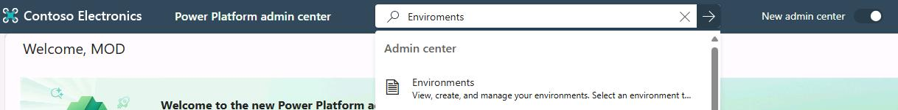

1. Select the **Contoso (default)** environment. 

    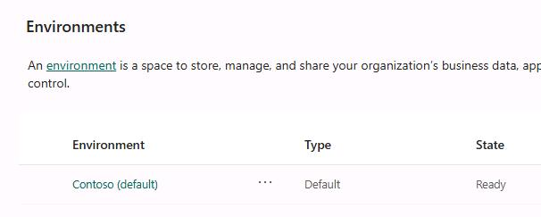

1. In the **Access** tile for the environment, in the **Environment admin** section, select **See all**.

    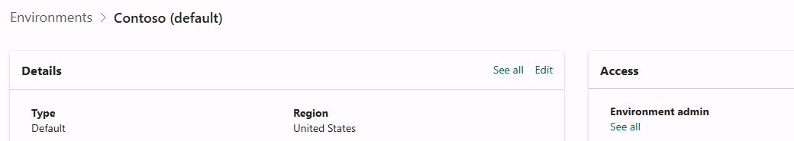

1. On the **Environment admin** page, select **+ Add users**.

    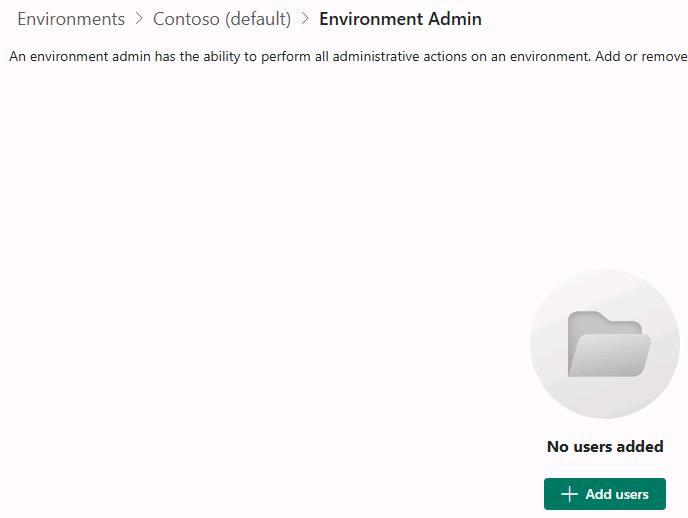

1. In the **Add people to the Environment Admin security role** pane, enter  `@lab.CloudCredential(WWLM365Enterprise201920SStakeholderKimFrank).AdministrativeUsername` in the **Search field**.

    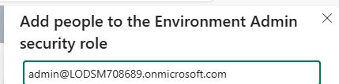

1. Select the user and then select **Add**.

    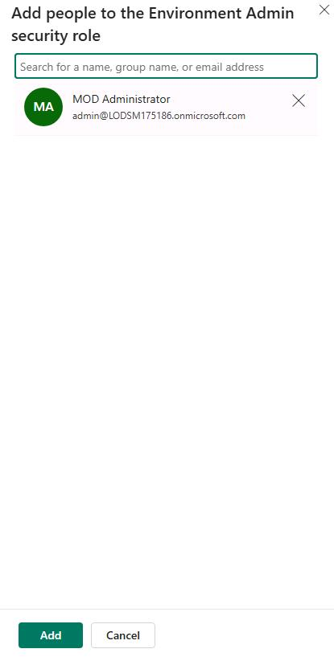

1. At the top of the page, select **Contoso (default)** to return to the details page for the environment.

    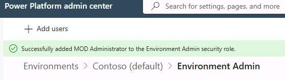

1. On the **Add Dataverse** tile, select **+ Add Dataverse**.

    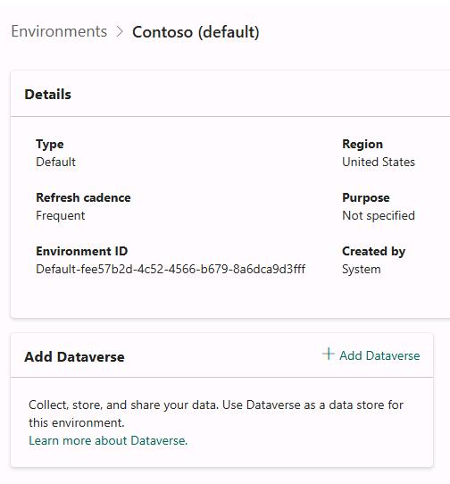

1. On the **New database** pane, set the **Deploy sample apps and data** slider to **No** and then select **Add**.

    {: .warning }
    >  It is important to set the **Deploy sample apps and data** slider to **No**. When you deploy Dataverse without sample apps and data, the process only takes 2-3 minutes. 
    >
    > If you deploy sample apps and data, it may take 10-15 minutes for deployment to complete. 

    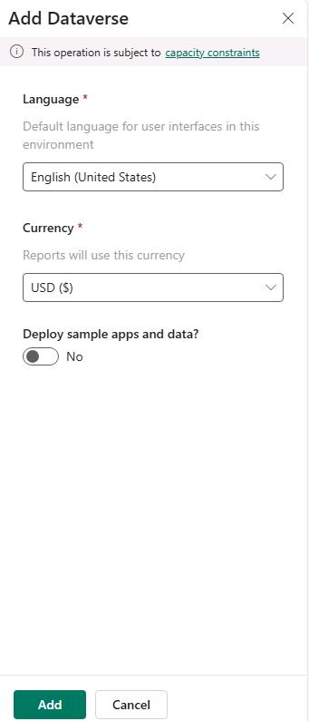

1. On the **Environments** page, wait until the value of the **State** column changes to **Ready** before proceeding to Task 02. This process may take 2-3 minutes.

    {: .note }
    > When you selected **Add** in Step 11, the value of the **State** column changed from **Ready** to **Preparing**. This indicates that the Dataverse deployment is in progress. 
    >
    > 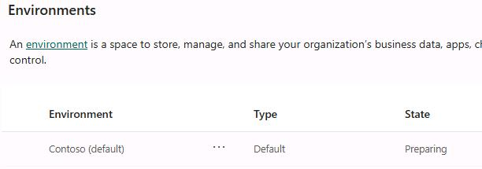
    >
    > The value for the column will change back to **Ready** when the deployment completes.
    >
    > 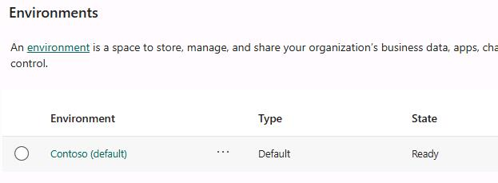

1. Close the Power Platform Admin center page.