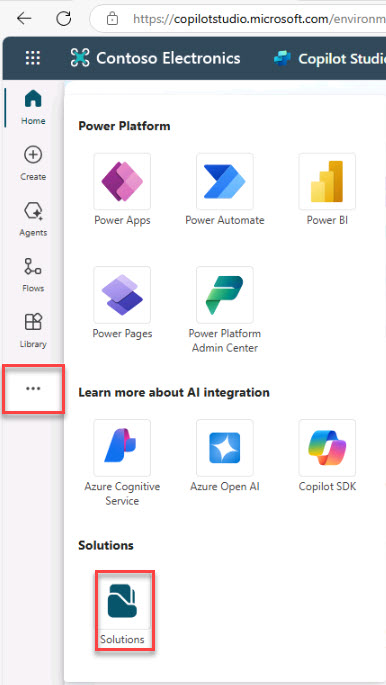
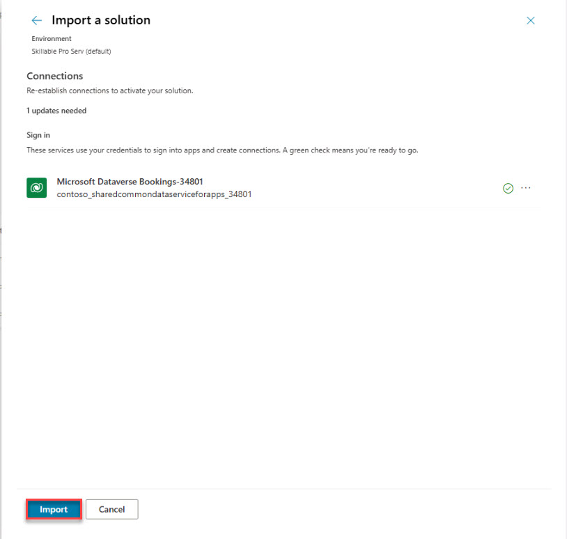

# Task 01: Create a Copilot Studio sandbox

1. Watch the video **TechExcel_CDX_Setup.mp4** and follow the instructions.

    <video style="width: 640px; height: 360px;" controls> 

    <source src="../../media/TechExcel_CDX_Setup_compressed.mp4" type="video/mp4"> 

    
Video not supported. <a href="../../media/TechExcel_CDX_Setup_compressed.mp4">Download it instead</a>.
 

    </video> 

1. Open a browser, go to **[Copilot Studio](https://copilotstudio.microsoft.com)**,  and sign in with the following credentials:

    | Item | Value |
    |----------|---------|
    | **Username** | **Copilot Studio username** |
    | **Password** | **Copilot Studio password** |

1. Download this file go to [Bookings_1_0_0_3.zip](../../media/Bookings_1_0_0_3.zip).

1. On the left pane, select the ellipses and then select **Solutions**.

    

1. On the solutions page, near the top of the page, select **Import solution**.

1. On the **Import a solution** flyout, select **Browse**. go to  where yoyu saved Bookings_1_0_0_3.zip, select it and then select **Next**.

1. Review the details and select **Next**.

1. Select **Import**.

    

    {: .warning }
    > If you get an error, use [FixBookingsSolution.docx](../../media/FixBookingSolution.docx).

1. On the solutions page, near the top of the page, select **Publish all customizations**.

    
