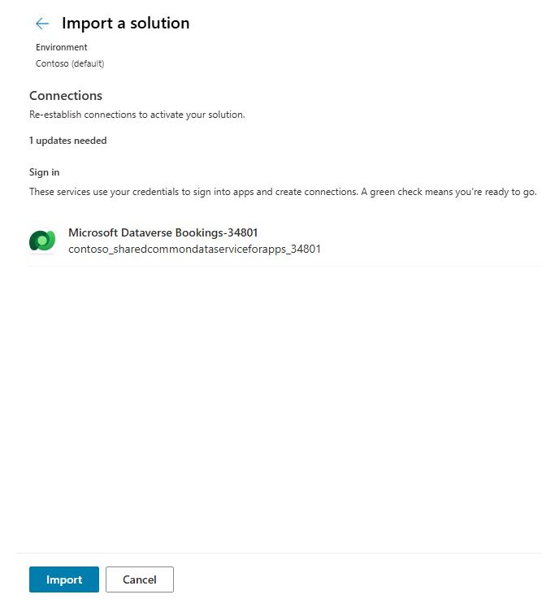

## Task 02: Import a pre-built solution into the environment

### Introduction 
For this lab, instead of building Dataverse tables, agents, and apps, you'll import a pre-built solution that already contains all of these resources. This way, you can focus on how all of these resources work and their business value.

 
### Description 
In this task, you'll open Copilot Studio and import a pre-built solution named **Bookings**.

 
### Success criteria
The solution is imported into the **Contoso (default)** environment.

1. Open a new browser tab and go to **[Copilot Studio](https://copilotstudio.microsoft.com)**. If prompted, sign in by using your credentials.

1. In the **Welcome to Microsoft Copilot Studio** dialog, select **Start free trial**.

    

1. If the **Welcome to Copilot Studio!** dialog displays, select **Skip**.

    

1. In the left navigation pane, select the ellipses (**...**) and then select **Solutions**.

     

1. On the solutions page, in the menu bar, select **Import solution**. 

    

1. On the **Import a solution** pane, select **Browse**.

    

1. Go to **C:\LabFiles**, select **Bookings_1_0_0_3.zip** and then select **Open**. 

    

1. On the **Import a solution** pane, select **Next**. 

    

1. Select **Next** again. 

    

1. Select **Import**.

    

1. Wait for the import process to complete. The **Solutions** page displays a message to alert you about progress.

    {: .note }
    > It may take 2-3 minutes for Copilot Studio to finish importing the solution.

    

    

1. On the solutions page, near the top of the page, select **Publish all customizations**. 

    

1. Wait until the customizations are published before you proceed to Exercise 01. Leave the **Solutions** page open. You'll return to the page in `Exercise 01, Task 02`.

    {: .note }
    > It may take 2-3 minutes for Copilot Studio to finish importing the solution.

    
