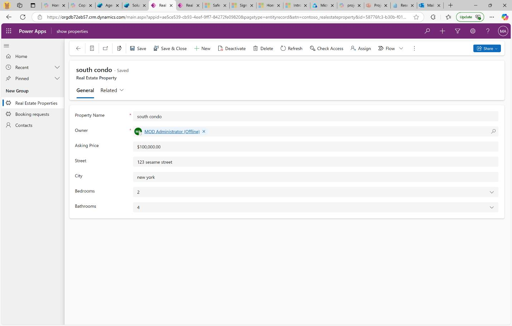

# Task 02: Examine the present state of the app

## Introduction
Contoso Real Estate has already invested in Microsoft platforms including **M365** and **Power Platform** to rapidly build their app. Their solution includes these components:

-   Model-driven app that can create records for properties and bookings
-   Manual data entry and phone or personal interactions, with much transcription

Contoso reviews its existing Dataverse app to spot manual steps that slow sales reps.

## Description
You'll open the Bookings solution, run the model driven app, and create two sample property records.

## Success criteria
 - The Bookings solution opens and the model driven app launches successfully.
 - Two properties (North Offices and South Condo) are saved and visible in the Properties view.
 - You can navigate app tables and confirm data is stored in Dataverse.

## Learning resources 
- <a href="https://learn.microsoft.com/en-us/training/modules/build-first-model-driven-app-dataverse/" target="_blank" rel="noopener noreferrer">
  Microsoft Learn: How to build your first model-driven app with Dataverse
</a>

## Key steps

### 01: Examine the present state of the app

1. On the Copilot Studio **Solutions** page, in the list of solutions, select **Bookings**. 

    
 
1. Review the resources that the solution includes. The solution includes nine categories of resources and a total of 47 resources.

     
 
1. In the **Objects** pane, select **Apps**. 

    

1. To the right of the **show properties** app, select the vertical ellipses and then select **Play** to open the app. 

    

    {: .important }
    >  The app will open in a Power Apps tab. Your app will only have blank Dataverse tables that you can explore using the left navigation once populated. This will be used by the Sales Representatives. 

1. Add a real estate property by using the following information: 

    | Default | Value | 
    |:---------|:---------| 
    | Property Name   | +++**North Offices**+++  | 
    | Owner   | If necessary, add your user   | 
    | Asking Price   | +++**$200,000.00**+++   | 
    | Street   | +++**321 Bellevue Drive**+++   |    
    | City   | +++**Redmond**+++   | 
    | Bedrooms   | **3** |   
    | Bathrooms   | **5**   | 

     

1. Select **Save & Close**. 

1. Add another real estate property by using the following information: 

    | Default | Value | 
    |:---------|:---------| 
    | Property Name   | +++**South Condo**+++  | 
    | Owner   | If necessary, add your user   | 
    | Asking Price   | +++**$100,000.00**+++   | 
    | Street   | +++**123 Sesame Street**+++   |     
    | City   | +++**New York**+++   | 
    | Bedrooms   | **2** |   
    | Bathrooms   | **4**   | 

     

1. Select **Save & Close**. 

     

---

You've completed lab exercises 0 and 1. Next, please return to the course and complete lessons 6, 7, and 8. 

If you're followong these instructions during the live workshop, once you finish those lessons, you'll be provided with a password. Enter the password here to unlock the lab environment and begin exercises 2 and 3. 

If you're using your own license, you won't need the password.

{: .warning }
>  The lab is configured to automatically save your progress and then exit after a period of inactivity. Use the process you used when you launched the lab to resume the lab.

@lab.Activity(Unlock1)
