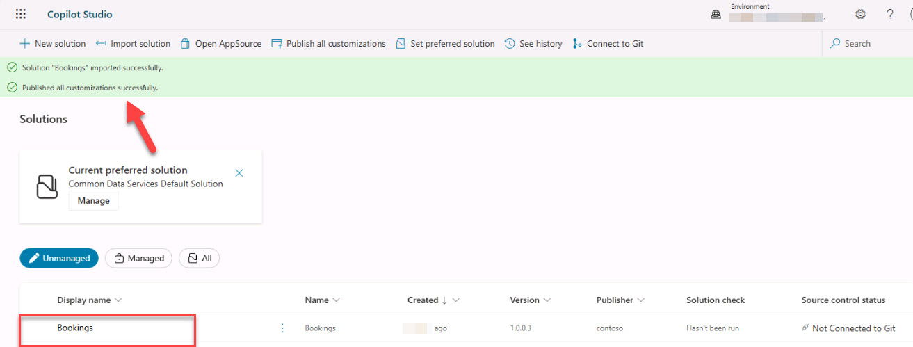
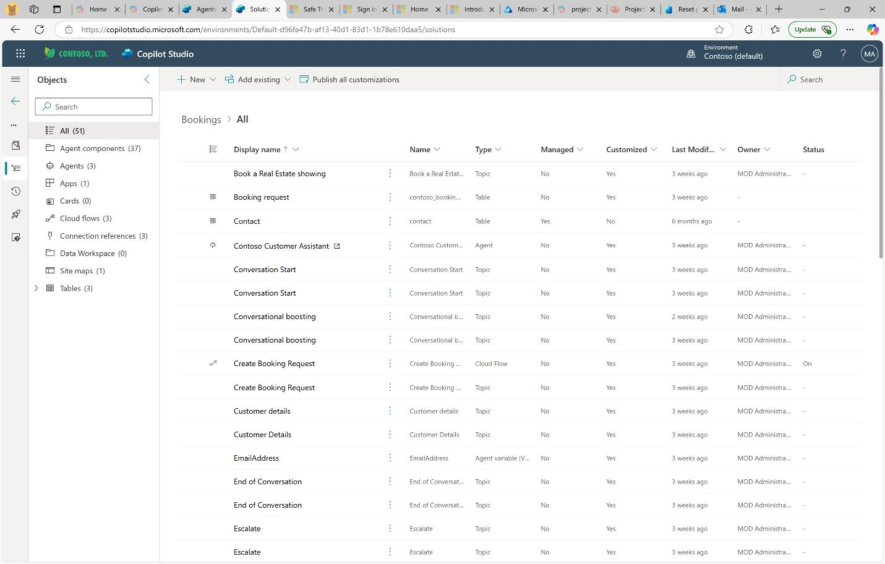
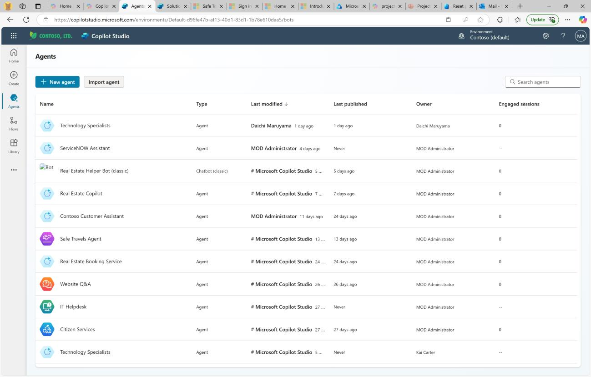
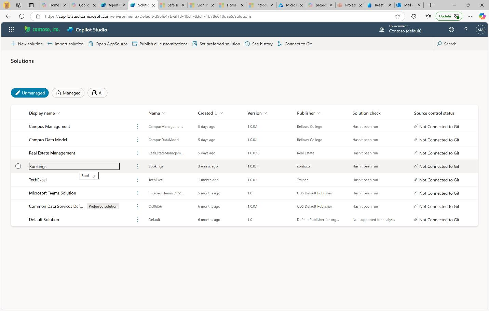
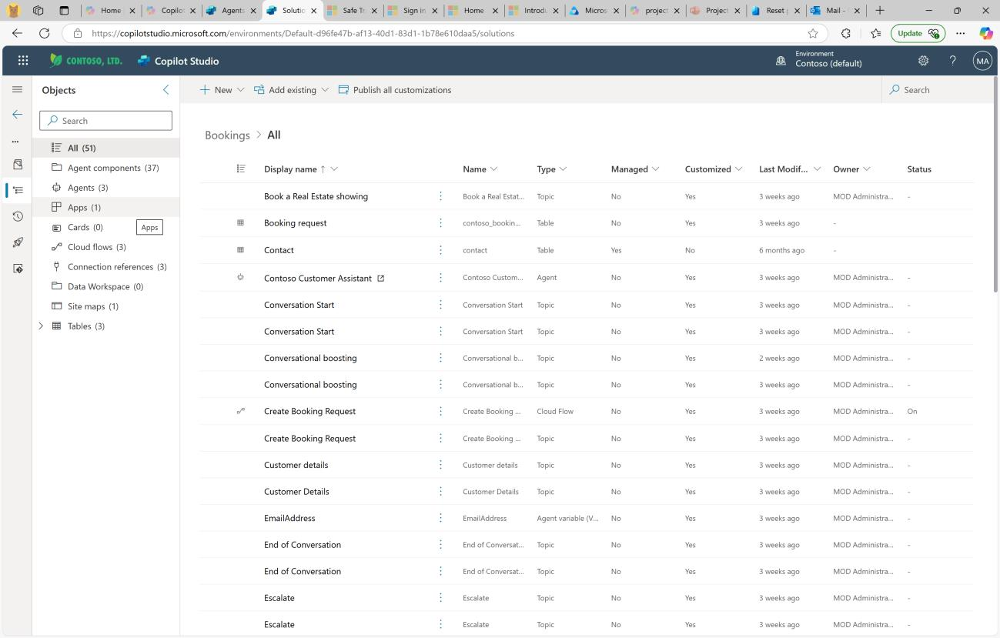

## Task 02: Examine the present state of the app

## Introduction
Contoso Real Estate has already invested in Microsoft platforms including **M365** and **Power Platform** to rapidly build their app. Their solution includes these components:

-   Model-driven app that can create records for properties and bookings
-   Manual data entry and phone or personal interactions, with much transcription

Contoso reviews its existing Dataverse app to spot manual steps that slow sales reps.

## Description
You will open the Bookings solution, run the model driven app, and create two sample property records.

## Success criteria
•	The Bookings solution opens and the model driven app launches successfully.
•	Two properties (North Offices and South Condo) are saved and visible in the Properties view.
•	You can navigate app tables and confirm data is stored in Dataverse.

## Learning resources 
- [Microsoft Learn: Introduction to model-driven apps](https://learn.microsoft.com/en-us/training/modules/model-driven-apps/)
- [Microsoft Power Platform: Dataverse](https://learn.microsoft.com/en-us/power-platform/admin/dataverse)

## Key steps

### 01: Examine the present state of the app

1. Once the customizations are published successfully, select **Bookings**.

    

1. Explore the existing app contents.

    

   {:.highlight}
    >
    

Expand here for help

    >
    >If you aren’t in **Solutions**, navigate there by going to **Home** \> **Agents** and then select the **Bookings** solution.
    
    >
    >
    >
    
    

1. On the left, on the **Objects** pane, select **Apps**.

     -->

1. Select the **Command** ellipses and then select **Play** to open the app.

    

    {:.important}
    > The app will open in a Power Apps tab. Your app will only have blank Dataverse tables that you can explore using the left navigation once populated. This will be used by the Sales Representatives.

1. Add a real estate property by selecting **+New**, then create an entry with the following information:

    | Default | Value |
    |:---------|:---------|
    | Property Name   | +++**North Offices**+++  |
    | Owner   | If necessary, add your user   |
    | Asking Price   | +++**$200,000.00**+++   |
    | Street   | +++**321 Bellevue Drive**+++   |   
    | City   | +++**Redmond**+++   |
    | Bedrooms   | **3** |  
    | Bathrooms   | **5**   |

    
    
1. Select **Save & Close**.

1. Add another real estate property by selecting **+New**, then create another entry with the following information:

    | Default | Value |
    |:---------|:---------|
    | Property Name   | +++**South Condo**+++  |
    | Owner   | If necessary, add your user   |
    | Asking Price   | +++**$100,000.00**+++   |
    | Street   | +++**123 Sesame Street**+++   |    
    | City   | +++**New York**+++   |
    | Bedrooms   | **2** |  
    | Bathrooms   | **4**   |

    

1. Select **Save & Close**.

