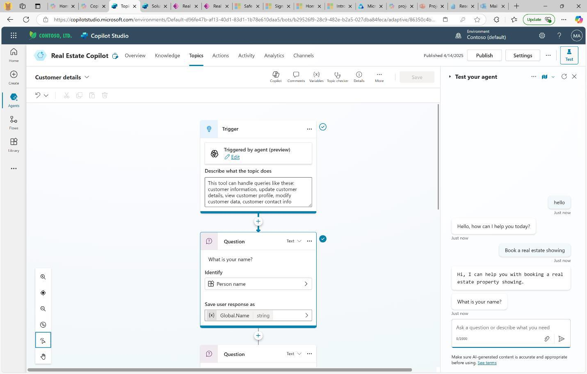
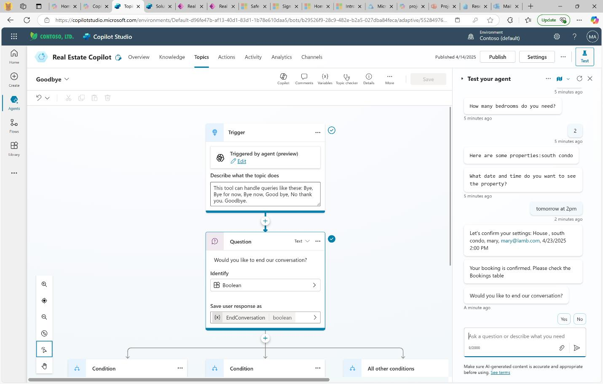

# Task 01: Explore how an agent works

## Introduction 
Contoso's tech leads inspect agent behavior to gauge configurability and reliability. 
 
## Description 
You will open the Real Estate Copilot in test mode, enable topic tracking, and walk through a booking scenario. 

## Success criteria 
- The agent responds to *Hello* with a welcome message. 
- When prompted with criteria (for example, a 2-bedroom house), the agent returns a matching property. 
- A booking confirmation dialog displays in the test pane transcript. 

## Learning resources
- Want to learn how this agent was created? Explore the <a href="https://learn.microsoft.com/en-us/training/modules/manage-power-virtual-agents-topics/" target="_blank" rel="noopener noreferrer">
  module on Microsoft Learn for a behind-the-scenes look. 
</a>

## Key steps

### 01: Test your agent

1. Return to the browser tab that displays the **Bookings** solution. 

	

1. In the **Objects** pane, select **Agents**.  

    

1. Select the **Real Estate Copilot** agent. 
 
    
 
1. At the upper right of the **Real Estate Copilot** page, select **Test**.

	 
 
1. On the **Test your agent** pane, select the **More** ellipses and then enable **Track between topics**.

	

    {: .important }
    >  Turning on tracking allows you to see how the agent uses different topics based on your keywords.
 
1. In the **Test your agent** pane, enter the following prompt, and then press **Send** (right-facing triangle) to submit the prompt: 

    ```
    Hello 
    ``` 

    

1. Observe the response and then submit the following prompt: 

    ```
    Book a real estate showing 
    ``` 
 
    > **Example Output:** 
    >  
 
1. Respond to the prompts by adding your name and email address and then select **Yes** to confirm the details. 

1. Select **House** for the property type and enter +++**2**+++ as the number of bedrooms. 

    {: .note }
    > The agent will search the properties in the back-end Dataverse tables and find one that matches. 

1. When asked, **What date and time do you want to see the property?**, enter the following prompt: 

    ```
    tomorrow at 2pm 
    ``` 

    {: .note }
    > After completing the booking, the agent will confirm the details and then ask if you're done and whether you're satisfied. 

	
