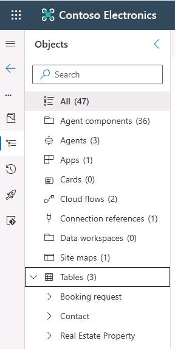
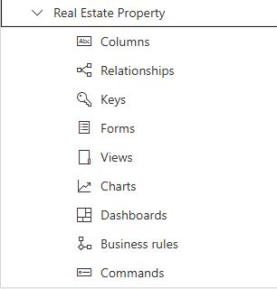
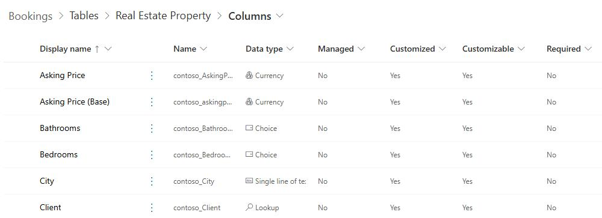
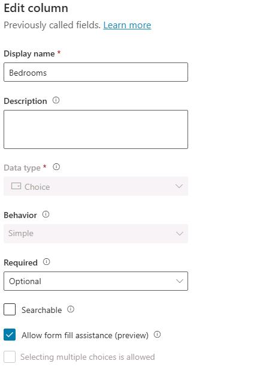
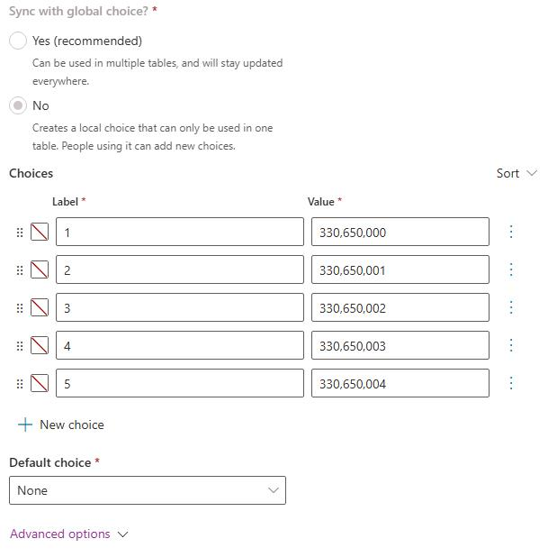

# Task 02: Explore the mechanics of the agent 

## Introduction 
Contoso must ensure the agent's data layer aligns with existing Dataverse schemas. 

## Description 
You will review Microsoft Learn content on creating custom tables and relate it to the agent's property and booking entities. 

## Success criteria 
- You identify which custom tables support property and booking data. 
- You can explain how the agent reads from and writes to these tables. 

## Learning resources
- This task is based on and is a subset of content on Microsoft Learn.  Visit <a href="https://learn.microsoft.com/en-us/training/modules/create-bots-power-virtual-agents-copilot/exercise-create-tables" target="_blank" rel="noopener noreferrer"> Exercise - Create custom tables </a> to review how custom tables are created and used to support the agent's functionality. 

## Key steps

### 01: Test the agent

1. Return to the browser tab that displays the **Bookings** solution. 

    

1. Expand the **Tables** node. As you can see, the solution adds three custom tables to Dataverse to support the solution.

    

1. Expand the **Real Estate Property** node and review all of the table elements.

    

    {: .important }
    > Each table consists of many elements including columns, keys, and business rules. You can create and update any of these elements by using an intuitive, web-based user interface.

1. Select **Columns**. You'll see a list of all of the columns included in the table and information about each column.

    

    {: .important }
    > For each new column, you must provide a name and specify a data type (for example, Currency, Choice, and Whole number). You can also configure other elements to define the behavior of the column (for example, is data required).

1. In the list of columns, select **Bedrooms**. The **Edit column** pane displays.

    

    

    {: .important }
    >  The **Bedrooms** column uses the **Choice** data type. You supply the values that are acceptable for the column. For the **bedrooms** column, valid values are 1, 2, 3, 4, or 5 bedrooms.

1. Leave the page open. You'll perform additional steps in Exercise 03.