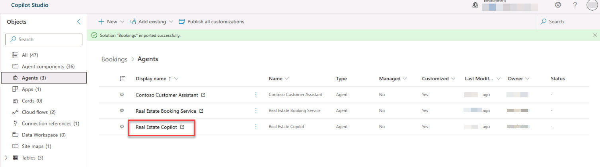
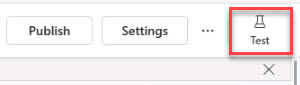
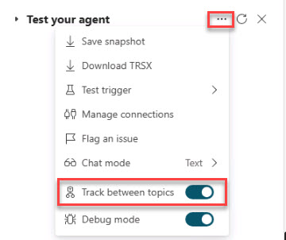
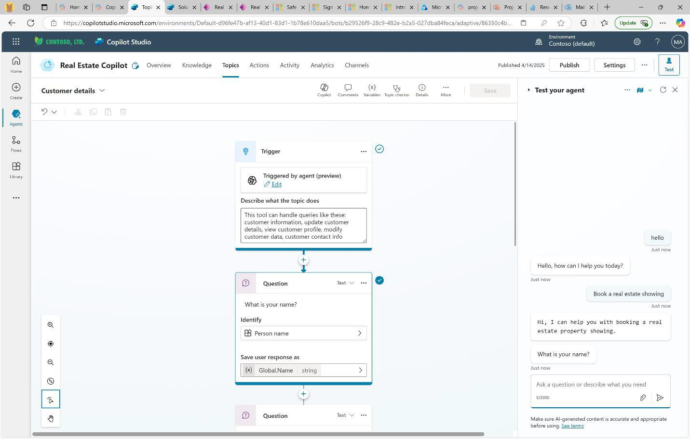
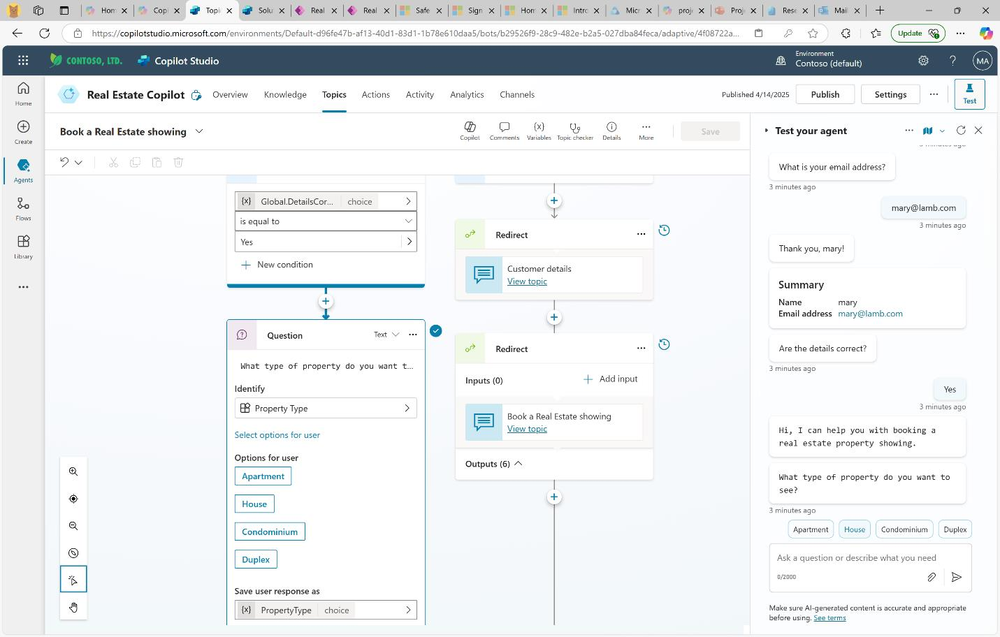
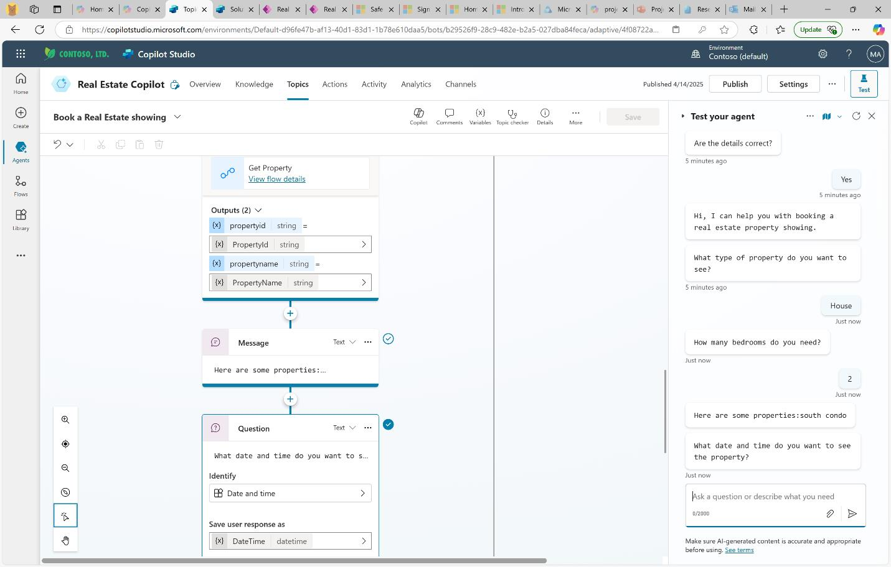
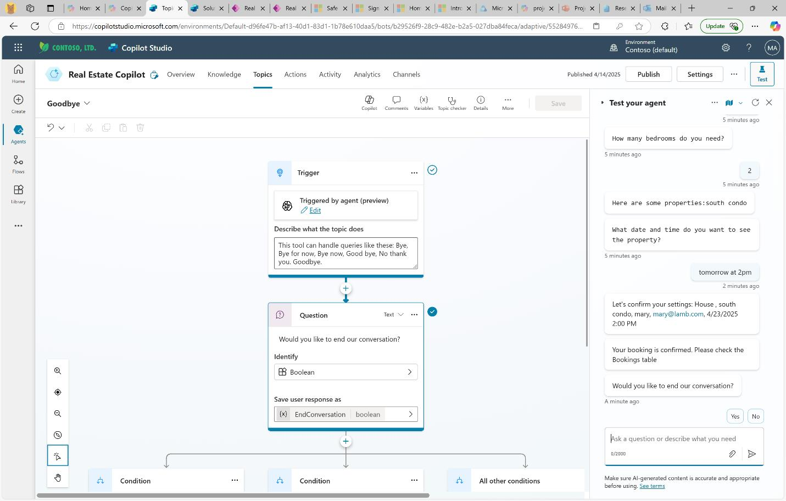

## Introduction
Contoso’s tech leads inspect agent behaviour to gauge configurability and reliability.

## Description
You will open the Real Estate Copilot in test mode, enable topic tracking, and walk through a booking scenario.

## Success criteria
•	Agent responds to Hello with a welcome message.
•	When prompted with criteria (e.g., 2 bedroom house), the agent returns a matching property.
•	Booking confirmation dialogue completes and appears in the test pane transcript.

## Learning resources
- [Microsoft Learn: Test and publish your bot](https://learn.microsoft.com/en-us/training/modules/test-publish-bot/)


## Key steps

### 01: Test the agent


1. Return to the browser tab that is signed into Copilot Studio Solutions.

1. On the left, on the **Objects** pane, select **Agents**. 

1. Select the **Real Estate Copilot** agent.

    

1. On the upper right of the Real Estate Copilot page, select **Test**.

         

1. On the **Test your agent** flyout, select the **More** ellipses and then enable **Track between topics**.

    

    {:.important}
    > Turning on tracking allows you to see how the agent uses different topics based on your keywords.

1. In the **Test your agent** prompt, enter the following: 

    ```Prompt
    Hello
    ```

1. Observe the response and then enter the following:

    ```Prompt
    Book a real estate showing
    ```

    >**Example Output:**
    >
    

1. Respond to the prompts with your name and email address and then select **Yes** to confirm the details.

    <!-- Enter your *name* and *email address*, then confirm by selecting **yes**
     -->

1. Select **House** for the property type and enter **2** for the number of bedrooms.
    <!--  -->

    {:.note}
     > The agent will search the properties in the back-end Dataverse tables and find one that matches.
    <!--  -->

1. When asked, **What date and time do you want to see the property?**, enter the following:

    ```Prompt
    tomorrow at 2pm
    ```

    {:.note}
     > After completing the booking, the agent will confirm the details, then ask if you're done and whether you're satisfied.

1. Enter **yes** to acknowledge the booking confirmation, but **don’t end the conversation**[DM2.1]. When prompted, select **No** to continue.

   

{:.note} 
> Want to learn how this agent was created? Explore the [**Exercise – Create and manage topics**](https://learn.microsoft.com/en-us/training/modules/manage-power-virtual-agents-topics/) module on Microsoft Learn for a behind-the-scenes look.
