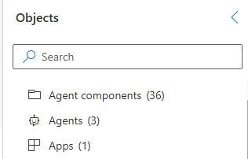
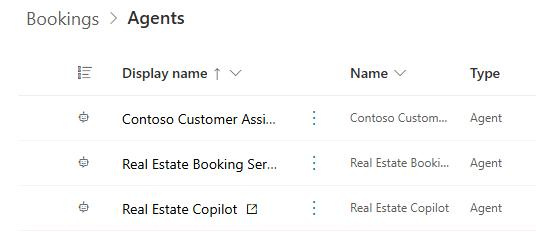
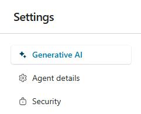
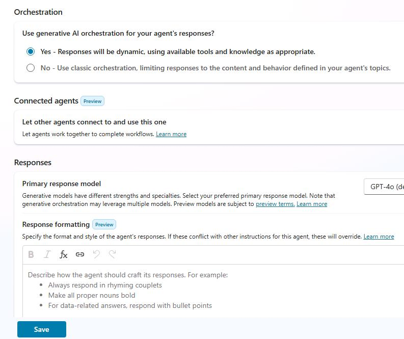

# Task 01: Review generative AI configuration

## Introduction 
Contoso wants to confirm that the agent's answers stay accurate and on brand when powered by generative AI. 

## Description 
In this task, you will enable generative AI and configure the Conversational boosting topic to use generative AI.

## Success criteria 
- Generative AI is enabled
- The Conversational boosting topic for the agent is configured to use generative AI.

## Learning resources
- This task is based on and is a subset of content from the following Microsoft Learn article: <a href="https://learn.microsoft.com/en-us/training/modules/create-bots-power-virtual-agents-copilot/exercise-generative-ai" target="_blank" rel="noopener noreferrer">
  Exercise - Set up Generative AI
</a>.

## Key steps

1. On the Copilot Studio page, in the **Objects** pane, select **Agents**.

    

1. In the list of agents, select **Real Estate Copilot**.

    

1. At the top right of the page, select **Settings**.

    

1. In the list of categories, select **Generative AI**.

    

1. In the **Orchestration** section, select **Yes** and then select **Save**.

    

1. At the top right of the **Settings** page, select **Close** (**x**).

    

1. Leave the **Real Estate Copilot** page open. You'll perform additional steps in the agent in Task 02.