## Task 02: Configure knowledge sources  

## Introduction 
Contoso wants to use some of its own content as a knowledge source for the agent to improve the quality of responses.

## Description 
In this task, you'll enable Knowledge and configure a knowledge source.

## Success criteria 
The agent is configured to use a website as a knowledge source.

## Learning resources 
- This task is based on and is a subset of content from the following Microsoft Learn article: <a href="https://learn.microsoft.com/en-us/training/modules/create-bots-power-virtual-agents-copilot/exercise-generative-ai" target="_blank" rel="noopener noreferrer">
  Exercise - Set up Generative AI
</a>.


## Key steps

### 01: Enable knowledge

1. On the menu bar for the **Real Estate Copilot** page, select **Knowledge**.

   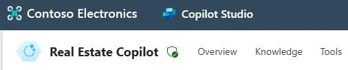

1. Select **+ Add knowledge**.

    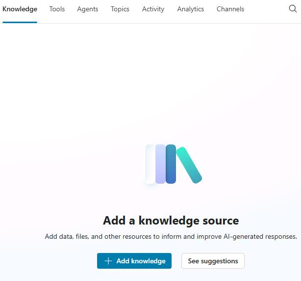

1. In the **Add knowledge** dialog, select the **Public websites** tile.

    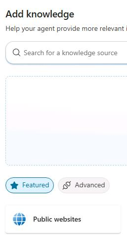

1. In the **Public website link** field, enter 

    ```
    https://create.microsoft.com/templates/real-estate
    ```
    
    Then select **Add**.

    {: .note }
    > This website is managed by Microsoft. It contains a series of real estate-related design templates.
    
    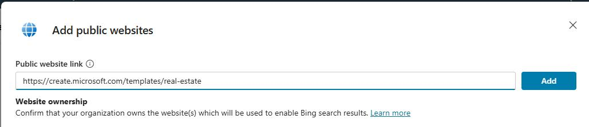

1. In the **Add public websites** dialog, select **Add to agent**. You are returned to the **Knowledge** page.

    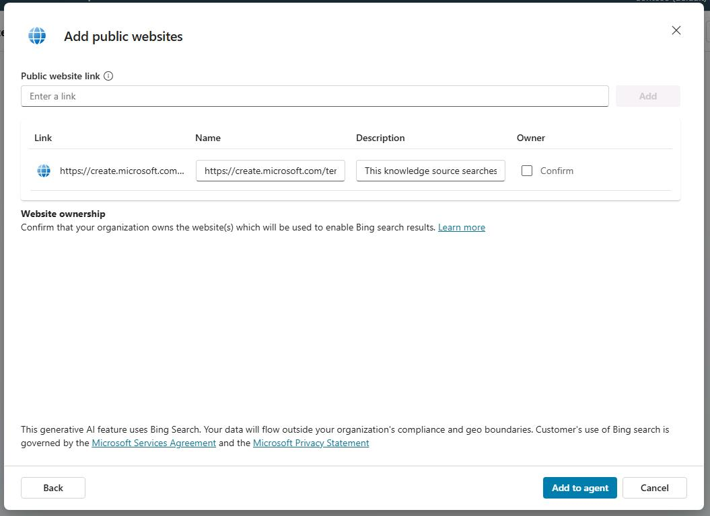
    
1. On the **Knowledge** page, select **+ Add knowledge**.

    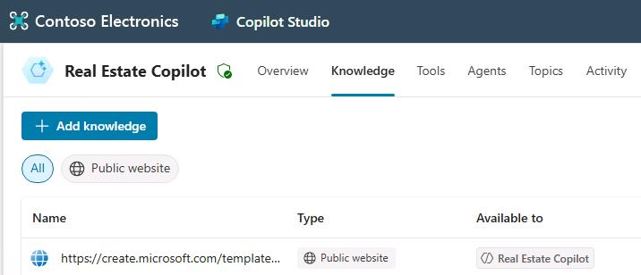

1. In the **Add knowledge** dialog, select the **Dataverse** tile.

    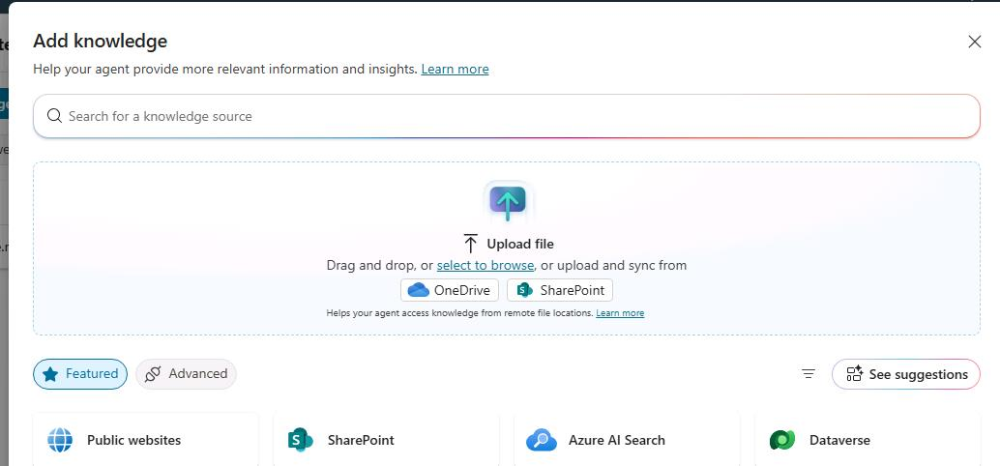

1. In the list of tables, select the **Real Estate Property** table, and then select **Add to agent**.

    {: .note }
    > This step ensures that the agent can directly access all of the property records in Dataverse.

    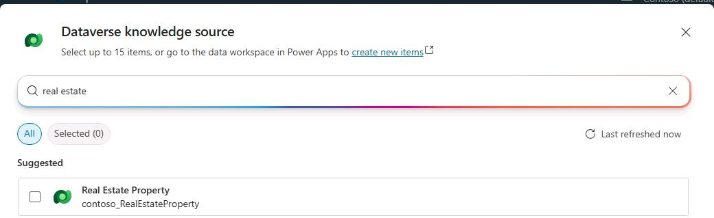

### 02: Use generative answers in System fallback topic 

1. Navigate back to the agent's Topics tab and select System.
    
    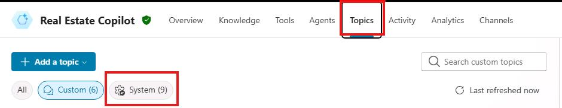

1. Select the **Fallback** topic.

    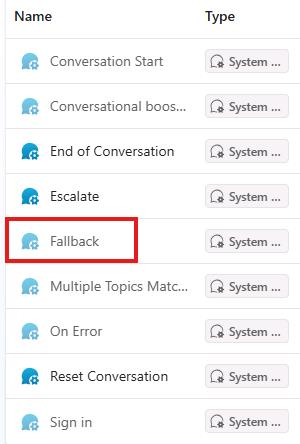

1. Select the **three dots** in the message node and select **Delete**.

    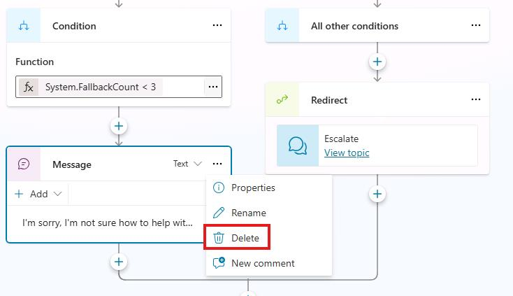

1. Select the the **+** icon under the Condition node, select **Advanced**, and select **Generative answers**.

    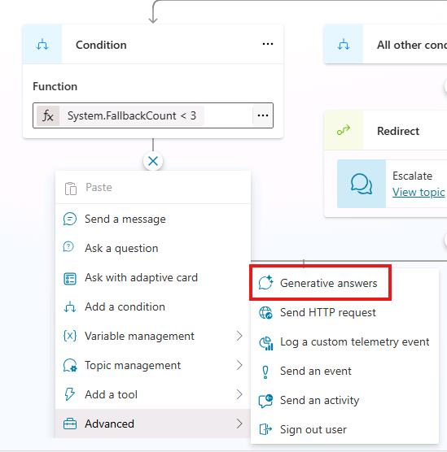

1. On the **System** tab, select **Activity.Text** for the Input field.
    
    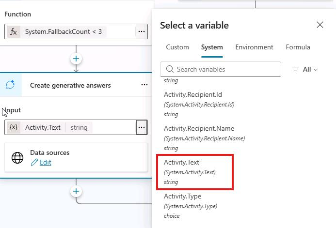

1. Select **Edit** under Data sources.

1. Select **Search only selected sources**.

1. Select the **Real Estate Property** Dataverse table.

1. Deselect **Allow the AI to use its own general knowledge**.

1. Select **Medium** for Content moderation.

1. **Save** the topic.

### 03: Configure security

1. Select **Settings** in the top-right of the screen.

    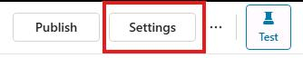

1. Select the **Security** tab.

    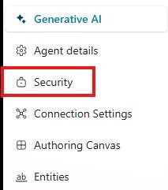

1. Select the **Authentication** tile.

1. Select **Authenticate with Microsoft**.

1. Select **Save**.

1. Select **Save** in the Save this configuration? window.

1. Close the settings window and then select **Publish** to publish the agent.

    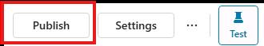

### 04: Test the Agent's knowledge

1. Select the **Test** button in the top-right of the screen to open the testing panel.

    

1. Select the **map icon** at the top of the test pane and make sure Show activity map when testing is set to **On**.

    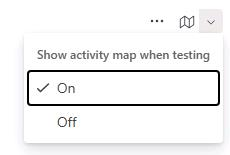

1. Select the **Start a new conversation** icon at the top of the testing panel.

1. Explore the agent and see how it uses the different knowledge sources.

1. Example prompts: 

    ```
    What are your opening hours?
    ```
    
    or 
    
    ```
    How do I apply for assistance?
    ```


---

{: .warning }
> **IMPORTANT:** These labs are hosted on the Skillable platform. Completion data is collected and then exported to Success Factors every Monday. SF require another 1-3 days to process that data. The status for this lab will be visible in Viva and Learning Path next week. 
> Be sure to select "**Submit**" in the bottom right corner to get credit for completing this lab. 

@lab.ActivityGroup(completionsurvey)

{: .warning }
>  After answering the survey questions, select **submit** to complete and end the lab. **This is required in order to receive credit for lab completion**.

# Congratulations! You have completed the Designing Your Own Agent with Copilot Studio lab! 
